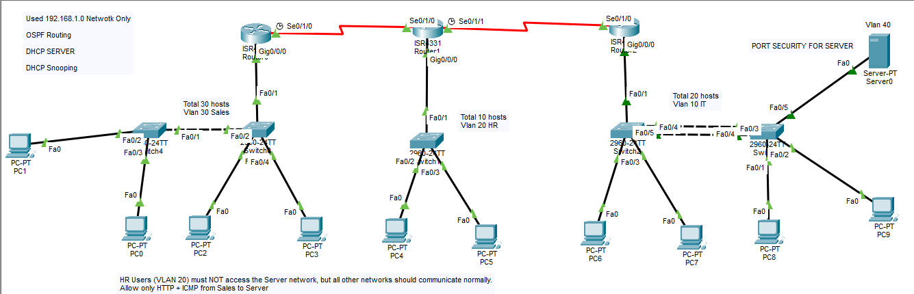

# Multi-Site OSPF with VLSM, ACLs, DHCP Snooping & Port Security

## Objective
Design and implement a 3-router WAN topology using OSPF for dynamic
routing, with VLSM subnetting from a single 192.168.1.0/24 block,
centralized DHCP via helper addresses, DHCP snooping + Dynamic ARP
Inspection, and ACLs enforcing inter-VLAN access restrictions. Port
security is applied on the server-facing switch port.

## Topology


- **Router0** — VLAN 30 (Sales), serial link to Router1
- **Router1** — VLAN 20 (HR), serial links to Router0 and Router2
- **Router2** — VLAN 10 (IT) and VLAN 40 (Server), serial link to Router1
- **Server0** — DHCP server for all VLANs, sits on VLAN 40 with DHCP
  snooping trust + port security enabled

## VLSM Addressing Scheme (192.168.1.0/24)

| Subnet          | Mask              | CIDR | Usable Range | Assigned To                |
|-------------------|-------------------|------|-----------------|-------------------------------|
| 192.168.1.0      | 255.255.255.224   | /27  | .1 – .30        | VLAN 30 – Sales (Router0)     |
| 192.168.1.32     | 255.255.255.224   | /27  | .33 – .62       | VLAN 10 – IT (Router2)        |
| 192.168.1.64     | 255.255.255.240   | /28  | .65 – .78       | VLAN 20 – HR (Router1)        |
| 192.168.1.80     | 255.255.255.252   | /30  | .81 – .82       | Router1 ↔ Router2 WAN         |
| 192.168.1.84     | 255.255.255.252   | /30  | .85 – .86       | Router0 ↔ Router1 WAN         |
| 192.168.1.88     | 255.255.255.252   | /30  | .89 – .90       | VLAN 40 – Server              |

## VLANs

| VLAN | Purpose | Gateway         | Router  |
|------|---------|-----------------|---------|
| 10   | IT      | 192.168.1.33/27 | Router2 |
| 20   | HR      | 192.168.1.65/28 | Router1 |
| 30   | Sales   | 192.168.1.1/27  | Router0 |
| 40   | Server  | 192.168.1.89/30 | Router2 |

## Key Configuration

### Router0 (Sales)

```
interface GigabitEthernet0/0/0.30
 encapsulation dot1Q 30
 ip address 192.168.1.1 255.255.255.224
 ip helper-address 192.168.1.90
 ip access-group 110 in

interface Serial0/1/0
 ip address 192.168.1.86 255.255.255.252
 clock rate 2000000

router ospf 1
 network 192.168.1.0 0.0.0.31 area 0
 network 192.168.1.84 0.0.0.3 area 0

access-list 110 permit icmp 192.168.1.0 0.0.0.31 192.168.1.88 0.0.0.3
access-list 110 permit tcp 192.168.1.0 0.0.0.31 192.168.1.88 0.0.0.3 eq www
access-list 110 deny ip 192.168.1.0 0.0.0.31 192.168.1.80 0.0.0.15
access-list 110 permit ip any any
```

### Router1 (HR)

```
interface GigabitEthernet0/0/0.20
 encapsulation dot1Q 20
 ip address 192.168.1.65 255.255.255.240
 ip helper-address 192.168.1.90
 ip access-group 110 in

interface Serial0/1/0
 ip address 192.168.1.85 255.255.255.252

interface Serial0/1/1
 ip address 192.168.1.82 255.255.255.252
 clock rate 2000000

router ospf 1
 network 192.168.1.64 0.0.0.15 area 0
 network 192.168.1.84 0.0.0.3 area 0
 network 192.168.1.80 0.0.0.3 area 0

access-list 110 deny icmp 192.168.1.64 0.0.0.15 192.168.1.88 0.0.0.3
access-list 110 permit icmp any any
```

### Router2 (IT + Server)

```
interface GigabitEthernet0/0/0.10
 encapsulation dot1Q 10
 ip address 192.168.1.33 255.255.255.224
 ip helper-address 192.168.1.90

interface GigabitEthernet0/0/0.40
 encapsulation dot1Q 40
 ip address 192.168.1.89 255.255.255.252

interface Serial0/1/0
 ip address 192.168.1.81 255.255.255.252

router ospf 1
 network 192.168.1.32 0.0.0.31 area 0
 network 192.168.1.88 0.0.0.3 area 0
 network 192.168.1.80 0.0.0.3 area 0
```

### Switch2 (Server-side — DHCP Snooping, DAI, EtherChannel, Port Security)

```
ip dhcp snooping
ip dhcp snooping vlan 40
ip arp inspection vlan 40

interface Port-channel1
 switchport mode trunk

interface FastEthernet0/1
 switchport mode access
 switchport access vlan 10

interface FastEthernet0/2
 switchport mode access
 switchport access vlan 10
 ip dhcp snooping limit rate 10

interface range FastEthernet0/3 - 4
 switchport mode trunk
 channel-group 1 mode active
 ip dhcp snooping limit rate 10

interface FastEthernet0/5
 switchport mode access
 switchport access vlan 40
 switchport port-security
 switchport port-security mac-address sticky
 switchport port-security mac-address sticky 0060.3EC1.C6DC
 ip dhcp snooping trust
 ip arp inspection trust
 ip dhcp snooping limit rate 10
```

### EtherChannel (Router2's switches, LACP)

```
interface FastEthernet0/4
 switchport mode trunk
 channel-group 1 mode active

interface FastEthernet0/5
 switchport mode trunk
 channel-group 1 mode active
```

## Verification
- [x] OSPF adjacencies established across all three routers (all `network` statements match subnet/wildcard correctly)
- [x] DHCP relay configured via `ip helper-address 192.168.1.90` on all client VLAN subinterfaces
- [x] DHCP snooping enabled and rate-limited on access/trunk ports
- [x] Dynamic ARP Inspection trusted on server-facing port
- [x] Port security with sticky MAC configured on the server's switch port
- [x] EtherChannel (LACP, `channel-group 1 mode active`) configured between Router2's switches
- [x] End-to-end ping test confirming Sales → Server allowed (HTTP + ICMP only)
- [x] End-to-end ping test confirming HR → Server blocked

## Notes
- Router0's ACL 110 has a `deny ip 192.168.1.0 0.0.0.31 192.168.1.80 0.0.0.15`
  line. That destination range (`192.168.1.80/28`) actually spans the
  Router1↔Router2 WAN link, not the HR subnet (`192.168.1.64/28`). If the
  intent was blocking Sales from reaching HR directly, the address may need
  to be `192.168.1.64 0.0.0.15` instead — worth a quick check against your
  test results.

## Skills Demonstrated
Multi-router OSPF over serial WAN links, VLSM subnetting design, DHCP
relay (`ip helper-address`), DHCP snooping, Dynamic ARP Inspection,
extended ACLs for protocol-specific filtering, LACP EtherChannel,
port security with sticky MAC addressing
