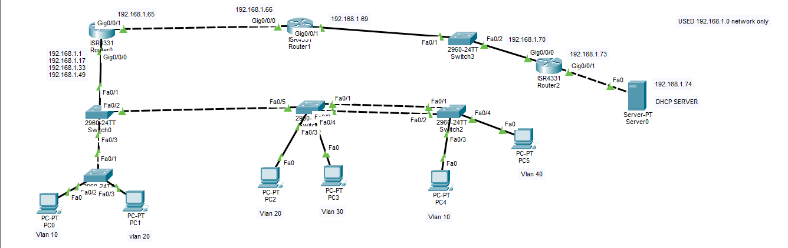

# Multi-Router OSPF with Router-on-a-Stick, EtherChannel & Telnet Access

## Objective
Build a 3-router topology connecting four VLANs through a single 
Router-on-a-Stick router, with OSPF providing dynamic routing across 
all router-to-router links, EtherChannel bundling redundant switch 
uplinks, and Telnet enabled for remote router access. DHCP is 
centralized on a server reachable via helper addresses across the WAN.

## Topology

- **Router0 (ISR4331)** — Router-on-a-Stick for VLANs 10/20/30/40, 
  DHCP relay to Server0
- **Router1 (ISR4331)** — transit router between Router0 and Router2
- **Router2 (ISR4331)** — connects to DHCP Server0, Telnet enabled 
  for remote access
- **Switch0** — access switch for VLAN 10 (PC0) and VLAN 20 (PC1)
- **Switch1** — EtherChannel to Router0's switch, access ports for 
  VLAN 20 (PC2) and VLAN 30 (PC3)
- **Switch2** — EtherChannel to Switch1, access ports for VLAN 10 
  (PC4) and VLAN 40 (PC5)
- **Switch3** — trunk link between Router1 and Router2
- **Server0** — centralized DHCP server

## VLSM Addressing Scheme (192.168.1.0/24)

| Subnet         | Mask              | CIDR | Usable Range  | Assigned To         |
|-----------------|-------------------|------|----------------|-----------------------|
| 192.168.1.0     | 255.255.255.240   | /28  | .1 – .14       | VLAN 10               |
| 192.168.1.16    | 255.255.255.240   | /28  | .17 – .30      | VLAN 20               |
| 192.168.1.32    | 255.255.255.240   | /28  | .33 – .46      | VLAN 30               |
| 192.168.1.48    | 255.255.255.240   | /28  | .49 – .62      | VLAN 40               |
| 192.168.1.64    | 255.255.255.252   | /30  | .65 – .66      | Router0 ↔ Router1 WAN |
| 192.168.1.68    | 255.255.255.252   | /30  | .69 – .70      | Router1 ↔ Router2 WAN |
| 192.168.1.72    | 255.255.255.252   | /30  | .73 – .74      | Router2 ↔ Server LAN  |

## VLANs
| VLAN | Gateway          | Hosts       |
|------|-------------------|-------------|
| 10   | 192.168.1.1/28    | PC0, PC4    |
| 20   | 192.168.1.17/28   | PC1, PC2    |
| 30   | 192.168.1.33/28   | PC3         |
| 40   | 192.168.1.49/28   | PC5         |

## Key Configuration

### Router0 (Router-on-a-Stick + DHCP Relay)

interface GigabitEthernet0/0/0.10
encapsulation dot1Q 10
ip address 192.168.1.1 255.255.255.240
ip helper-address 192.168.1.74

interface GigabitEthernet0/0/0.20
encapsulation dot1Q 20
ip address 192.168.1.17 255.255.255.240
ip helper-address 192.168.1.74

interface GigabitEthernet0/0/0.30
encapsulation dot1Q 30
ip address 192.168.1.33 255.255.255.240
ip helper-address 192.168.1.74

interface GigabitEthernet0/0/0.40
encapsulation dot1Q 40
ip address 192.168.1.49 255.255.255.240
ip helper-address 192.168.1.74

interface GigabitEthernet0/0/1
ip address 192.168.1.65 255.255.255.252

router ospf 1
network 192.168.1.0 0.0.0.15 area 0
network 192.168.1.16 0.0.0.15 area 0
network 192.168.1.32 0.0.0.15 area 0
network 192.168.1.48 0.0.0.15 area 0
network 192.168.1.64 0.0.0.3 area 0

### Router1 (Transit)

interface GigabitEthernet0/0/0
ip address 192.168.1.66 255.255.255.252

interface GigabitEthernet0/0/1
ip address 192.168.1.69 255.255.255.252

router ospf 1
network 192.168.1.64 0.0.0.3 area 0
network 192.168.1.68 0.0.0.3 area 0

### Router2 (Server-side, Telnet enabled)

enable password 123456

interface GigabitEthernet0/0/0
ip address 192.168.1.70 255.255.255.252

interface GigabitEthernet0/0/1
ip address 192.168.1.73 255.255.255.252

router ospf 1
network 192.168.1.68 0.0.0.3 area 0
network 192.168.1.72 0.0.0.3 area 0

line vty 0 4
password telnet
login
transport input telnet

### Switch0 (Router0-side access switch)

interface FastEthernet0/1
switchport mode trunk
interface FastEthernet0/2
switchport mode trunk
interface FastEthernet0/3
switchport mode trunk

### Switch1 (EtherChannel to Switch2, VLAN 20/30 access)

interface Port-channel1
switchport mode trunk

interface range FastEthernet0/1 - 2
switchport mode trunk
channel-group 1 mode active

interface FastEthernet0/3
switchport mode access
switchport access vlan 20

interface FastEthernet0/4
switchport mode access
switchport access vlan 30

interface FastEthernet0/5
switchport mode trunk

### Switch2 (EtherChannel to Switch1, VLAN 10/40 access)

interface Port-channel1
switchport mode trunk

interface range FastEthernet0/1 - 2
switchport mode trunk
channel-group 1 mode active

interface FastEthernet0/3
switchport mode access
switchport access vlan 10

interface FastEthernet0/4
switchport mode access
switchport access vlan 40

### Switch3 (Router1 ↔ Router2 trunk)

interface FastEthernet0/1
switchport mode trunk
interface FastEthernet0/2
switchport mode access
switchport access vlan 10
interface FastEthernet0/3
switchport mode access
switchport access vlan 20

## Verification
- [x] OSPF adjacencies established across Router0–Router1–Router2 (all WAN subnets included in `network` statements)
- [x] EtherChannel (LACP) configured between Switch1 and Switch2
- [x] DHCP relay configured via `ip helper-address 192.168.1.74` on all VLAN subinterfaces
- [x] Telnet access configured on Router2 (`transport input telnet`)
- [x] DHCP clients on all four VLANs successfully lease addresses from Server0
- [x] End-to-end ping test from each VLAN to Server0
- [x] Telnet login test to Router2 from a remote host

## Skills Demonstrated
Router-on-a-Stick across multiple VLANs, multi-router OSPF, DHCP relay 
via `ip helper-address`, LACP EtherChannel, VLSM subnetting, Telnet 
remote access configuration
