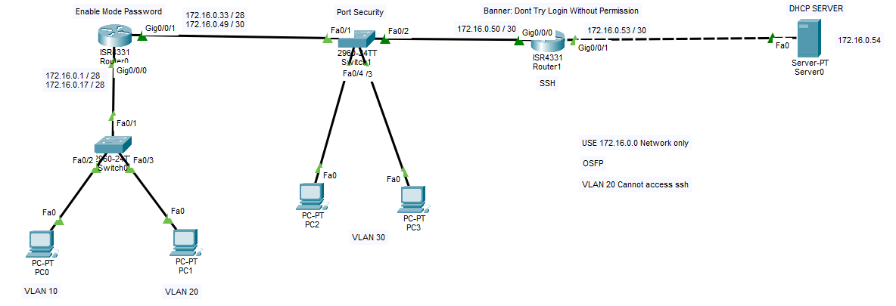

# Router-on-a-Stick with OSPF, SSH Hardening, Protocol-Specific ACL & Port Security

## Objective
Build a two-router topology using Router-on-a-Stick for three VLANs, with
OSPF providing dynamic routing between the routers and centralized DHCP
reached via helper addresses. SSH access to the second router is
restricted to a local user account with a login banner, VLAN 20 (HR) is
explicitly blocked from reaching SSH on the far router, and the
transit switch enforces sticky-MAC port security.

## Topology


- **Router0 (ISR4331)** — Router-on-a-Stick for VLAN 10 (IT) and VLAN 20
  (HR) via Switch0, plus VLAN 30 (Sales) via Switch1; enable-password
  protected; blocks VLAN 20 from SSH-ing Router1 and the server segment
- **Switch0** — access switch for VLAN 10 (PC0) and VLAN 20 (PC1)
- **Switch1 (2960-24TT)** — trunk between Router0 and Router1, access
  ports for VLAN 30 (PC2, PC3), sticky-MAC port security
- **Router1 / h1 (ISR4331)** — transit router to the DHCP server; SSH-only
  management via a local user account, login banner configured
- **Server0** — centralized DHCP server, `172.16.0.54`

## VLSM Addressing Scheme (172.16.0.0/24)

| Subnet         | Mask              | CIDR | Usable Range  | Assigned To                     |
|------------------|-------------------|------|-----------------|-------------------------------------|
| 172.16.0.0      | 255.255.255.240   | /28  | .1 – .14        | VLAN 10 — IT                       |
| 172.16.0.16     | 255.255.255.240   | /28  | .17 – .30       | VLAN 20 — HR                       |
| 172.16.0.32     | 255.255.255.240   | /28  | .33 – .46       | VLAN 30 — Sales                    |
| 172.16.0.48     | 255.255.255.252   | /30  | .49 – .50       | Router0 ↔ Router1 transit (via Switch1) |
| 172.16.0.52     | 255.255.255.252   | /30  | .53 – .54       | Router1 ↔ Server0                  |

## VLANs

| VLAN | Name | Gateway            | Hosts       | Access Policy                     |
|------|------|-----------------------|-------------|--------------------------------------|
| 10   | IT   | 172.16.0.1/28         | PC0         | Unrestricted                         |
| 20   | HR   | 172.16.0.17/28        | PC1         | SSH to Router1 & server segment blocked (ACL 110) |
| 30   | Sales| 172.16.0.33/28        | PC2, PC3    | Unrestricted; port security on switch access ports |

## Key Configuration

### Router0 (Router-on-a-Stick, OSPF, enable password, ACL)

```
hostname Router
enable password 123

interface GigabitEthernet0/0/0.10
 encapsulation dot1Q 10
 ip address 172.16.0.1 255.255.255.240
 ip helper-address 172.16.0.54

interface GigabitEthernet0/0/0.20
 encapsulation dot1Q 20
 ip address 172.16.0.17 255.255.255.240
 ip helper-address 172.16.0.54
 ip access-group 110 in

interface GigabitEthernet0/0/1
 ip address 172.16.0.49 255.255.255.252

interface GigabitEthernet0/0/1.30
 encapsulation dot1Q 30
 ip address 172.16.0.33 255.255.255.240
 ip helper-address 172.16.0.54

router ospf 1
 network 172.16.0.0 0.0.0.15 area 0
 network 172.16.0.16 0.0.0.15 area 0
 network 172.16.0.32 0.0.0.15 area 0
 network 172.16.0.48 0.0.0.3 area 0

! VLAN 20 (HR) blocked from SSH to Router1 and the server-side link
access-list 110 deny tcp 172.16.0.16 0.0.0.15 host 172.16.0.50 eq 22
access-list 110 deny tcp 172.16.0.16 0.0.0.15 172.16.0.52 0.0.0.3 eq 22
access-list 110 permit ip any any
```

### Switch0 (VLAN 10/IT — PC0, VLAN 20/HR — PC1)

```
interface FastEthernet0/1
 switchport mode trunk
interface FastEthernet0/2
 switchport mode access
 switchport access vlan 10
interface FastEthernet0/3
 switchport mode access
 switchport access vlan 20
```

### Switch1 (Transit trunk + VLAN 30/Sales — PC2, PC3, Port Security)

```
vlan 10
 name IT
vlan 20
 name HR
vlan 30
 name Sales

interface range FastEthernet0/1 - 2
 switchport mode trunk

interface range FastEthernet0/3 - 4
 switchport mode access
 switchport access vlan 30

interface range FastEthernet0/3 - 24
 switchport port-security
 switchport port-security maximum 2
 switchport port-security mac-address sticky
 switchport port-security violation restrict
```

### Router1 / h1 (SSH-only management, banner, DHCP relay, OSPF)

```
hostname h1
enable password 123
ip domain-name abc.com
username ssh privilege 15 password 0 ssh

interface GigabitEthernet0/0/0
 ip address 172.16.0.50 255.255.255.252

interface GigabitEthernet0/0/0.30
 encapsulation dot1Q 30
 ip address 172.16.0.33 255.255.255.240
 ip helper-address 172.16.0.54

interface GigabitEthernet0/0/1
 ip address 172.16.0.53 255.255.255.252

router ospf 1
 network 172.16.0.48 0.0.0.3 area 0
 network 172.16.0.52 0.0.0.3 area 0

banner motd ^CDont Try Login Without Permission^C

line vty 0 4
 login local
 transport input ssh
```

## Verification
- [x] OSPF adjacency up between Router0 and h1 across `172.16.0.48/30`
- [x] VLAN 10, 20, and 30 clients lease addresses from Server0 via `ip helper-address 172.16.0.54`
- [x] HR (VLAN 20) blocked from SSH to `172.16.0.50` and the `172.16.0.52/30` server segment — ACL 110
- [x] IT (VLAN 10) and Sales (VLAN 30) have unrestricted access
- [x] SSH-only remote access enforced on h1 (`transport input ssh`), authenticated against the local `ssh` account
- [x] Login banner displays on h1 before authentication
- [x] Port security (sticky MAC, max 2, violation restrict) active on Switch1's VLAN 30 access ports

## Skills Demonstrated
Router-on-a-Stick across multiple VLANs, VLSM subnetting, DHCP relay via
`ip helper-address`, OSPF dynamic routing over a mixed native/trunk link,
protocol-specific extended ACLs (blocking SSH by TCP port), enable-password
hardening, local-user SSH-only remote access with a login banner, and
sticky-MAC port security with a restrict violation mode.
