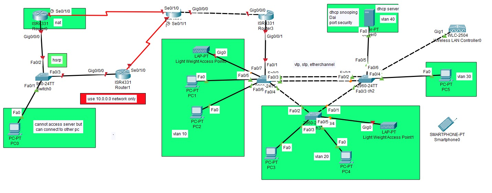

# Capstone: HSRP + NAT, Multi-Router OSPF, EtherChannel/STP, Wireless (WLC/LAP) & Layer 2 Security

## Objective
Bring together first-hop redundancy, WAN-style routing, wireless
infrastructure, and Layer 2 security into a single network. A dual-homed
HSRP pair provides redundant default gateway service for one segment,
NAT/PAT overloads that segment's traffic across a transit router to a
Router-on-a-Stick core, which routes four VLANs — one of them hosting a
centralized DHCP server, a WLC, and two Lightweight APs — over OSPF.
Access-layer switches enforce DHCP Snooping, Dynamic ARP Inspection, and
Port Security, with EtherChannel and tuned STP root bridges keeping the
switch mesh loop-free.

## Topology


- **Router0 & Router2 (ISR4331)** — HSRP pair on the `10.0.0.64/28`
  segment (virtual IP `.78`); Router0 additionally performs NAT
  overload (PAT) for that segment
- **Router1 (ISR4331)** — pure OSPF transit router linking the HSRP
  pair to the core over two serial P2P links
- **Router3 (ISR4331)** — Router-on-a-Stick core for VLANs 10/20/30/40,
  DHCP relay to Server0, ACL isolating the HSRP segment from the server
- **Switch0** — dual-uplink access switch for the HSRP pair (PC0)
- **Switch1** — access switch for VLAN 10 (PC1, PC2, LAP0), trunked
  into the switch mesh
- **Switch2** — STP root bridge for all VLANs, EtherChannel (LACP) to
  Switch1, DHCP Snooping + Dynamic ARP Inspection, Port Security on the
  server/WLC port, access switch for VLAN 30 (PC5)
- **Switch3** — access switch for VLAN 20 (PC3, PC4, LAP1, wireless
  clients)
- **Server0** — centralized DHCP server, `10.0.0.50` (VLAN 40)
- **WLC + LAP0/LAP1** — wireless controller and two lightweight APs
  providing CAPWAP-managed wireless access
- **PC0** — isolated by ACL from reaching Server0, but can reach every
  other host

## VLSM Addressing Scheme (10.0.0.0/24)

| Subnet       | Mask              | CIDR | Usable Range  | Assigned To                          |
|----------------|-------------------|------|-----------------|------------------------------------------|
| 10.0.0.0      | 255.255.255.240   | /28  | .1 – .14        | VLAN 10                                  |
| 10.0.0.16     | 255.255.255.240   | /28  | .17 – .30       | VLAN 20                                  |
| 10.0.0.32     | 255.255.255.240   | /28  | .33 – .46       | VLAN 30                                  |
| 10.0.0.48     | 255.255.255.240   | /28  | .49 – .62       | VLAN 40 — Server/WLC                     |
| 10.0.0.64     | 255.255.255.240   | /28  | .65 – .78       | HSRP segment (Router0/Router2), VIP `.78`|
| 10.0.0.80     | 255.255.255.252   | /30  | .81 – .82       | Router3 ↔ Router1                        |
| 10.0.0.84     | 255.255.255.252   | /30  | .85 – .86       | Router1 ↔ Router0                        |
| 10.0.0.88     | 255.255.255.252   | /30  | .89 – .90       | Router1 ↔ Router2                        |

## VLANs

| VLAN | Gateway         | Hosts                    |
|------|--------------------|------------------------------|
| 10   | 10.0.0.1/28        | PC1, PC2, LAP0                |
| 20   | 10.0.0.17/28        | PC3, PC4, LAP1                |
| 30   | 10.0.0.33/28        | PC5                            |
| 40   | 10.0.0.49/28        | Server0 (DHCP), WLC            |

## Key Configuration

### Router0 (HSRP standby, NAT overload)

```
interface GigabitEthernet0/0/0
 ip address 10.0.0.76 255.255.255.240
 ip helper-address 10.0.0.50
 ip nat inside
 standby 1 ip 10.0.0.78

interface Serial0/1/0
 ip address 10.0.0.86 255.255.255.252
 ip nat outside
 clock rate 2000000

router ospf 1
 network 10.0.0.64 0.0.0.15 area 0
 network 10.0.0.84 0.0.0.3 area 0

ip nat inside source list 1 interface Serial0/1/0 overload
access-list 1 permit 10.0.0.64 0.0.0.15
```

### Router2 (HSRP active — priority 110)

```
interface GigabitEthernet0/0/0
 ip address 10.0.0.77 255.255.255.240
 ip helper-address 10.0.0.50
 standby 1 ip 10.0.0.78
 standby 1 priority 110

interface Serial0/1/1
 ip address 10.0.0.90 255.255.255.252
 clock rate 2000000

router ospf 1
 network 10.0.0.88 0.0.0.3 area 0
 network 10.0.0.64 0.0.0.15 area 0
```

### Router1 (OSPF transit)

```
interface GigabitEthernet0/0/0
 ip address 10.0.0.82 255.255.255.252

interface Serial0/1/0
 ip address 10.0.0.85 255.255.255.252

interface Serial0/1/1
 ip address 10.0.0.89 255.255.255.252

router ospf 1
 network 10.0.0.84 0.0.0.3 area 0
 network 10.0.0.88 0.0.0.3 area 0
 network 10.0.0.80 0.0.0.3 area 0
```

### Router3 (Router-on-a-Stick core, DHCP relay, ACL)

```
interface GigabitEthernet0/0/0
 ip address 10.0.0.81 255.255.255.252
 ip access-group 110 in

interface GigabitEthernet0/0/1.10
 encapsulation dot1Q 10
 ip address 10.0.0.1 255.255.255.240
 ip helper-address 10.0.0.50

interface GigabitEthernet0/0/1.20
 encapsulation dot1Q 20
 ip address 10.0.0.17 255.255.255.240
 ip helper-address 10.0.0.50

interface GigabitEthernet0/0/1.30
 encapsulation dot1Q 30
 ip address 10.0.0.33 255.255.255.240
 ip helper-address 10.0.0.50

interface GigabitEthernet0/0/1.40
 encapsulation dot1Q 40
 ip address 10.0.0.49 255.255.255.240

router ospf 1
 network 10.0.0.0 0.0.0.15 area 0
 network 10.0.0.16 0.0.0.15 area 0
 network 10.0.0.32 0.0.0.15 area 0
 network 10.0.0.48 0.0.0.15 area 0
 network 10.0.0.80 0.0.0.3 area 0

! HSRP segment (PC0) blocked from reaching the DHCP server
access-list 110 deny ip 10.0.0.64 0.0.0.15 host 10.0.0.50
access-list 110 permit ip any any
```

### Switch0 (dual uplink to the HSRP pair)

```
interface FastEthernet0/1
 switchport mode trunk
interface FastEthernet0/3
 switchport mode trunk
```

### Switch1 (VLAN 10 access — PC1, PC2, LAP0)

```
interface Port-channel1
 switchport mode trunk

interface FastEthernet0/1
 switchport mode trunk

interface range FastEthernet0/2 - 3
 switchport mode trunk
 channel-group 1 mode active

interface FastEthernet0/4
 switchport mode trunk

interface range FastEthernet0/5 - 7
 switchport mode access
 switchport access vlan 10
```

### Switch2 (STP root, EtherChannel, DHCP Snooping, DAI, Port Security)

```
ip dhcp snooping vlan 10,20,30,40
ip dhcp snooping
ip arp inspection vlan 10,20,30,40

spanning-tree mode pvst
spanning-tree vlan 1,10,20,30,40 priority 4096

interface Port-channel1
 switchport mode trunk

interface range FastEthernet0/1 - 2
 switchport mode trunk
 channel-group 1 mode active
 ip dhcp snooping limit rate 10

interface FastEthernet0/3
 switchport access vlan 40
 switchport mode access
 ip dhcp snooping trust
 ip arp inspection trust
 switchport port-security
 switchport port-security mac-address sticky
 switchport port-security mac-address sticky 00E0.F922.6ADE

interface range FastEthernet0/4 - 5
 switchport access vlan 30
 switchport mode access
 ip dhcp snooping limit rate 10

interface FastEthernet0/6
 switchport mode trunk
 ip dhcp snooping limit rate 10
```

### Switch3 (VLAN 20 access — PC3, PC4, LAP1)

```
interface range FastEthernet0/1 - 2
 switchport mode trunk

interface range FastEthernet0/3 - 5
 switchport mode access
 switchport access vlan 20
```

## Verification
- [x] HSRP virtual IP `10.0.0.78` active on Router2 (priority 110), Router0 standing by
- [x] NAT overload translates the `10.0.0.64/28` segment out via Router0's Serial0/1/0
- [x] OSPF full adjacency across Router0–Router1–Router2–Router3
- [x] VLANs 10/20/30 lease addresses from Server0 via `ip helper-address 10.0.0.50`
- [x] PC0 (HSRP segment) blocked from Server0 (`access-list 110`), reaches every other host
- [x] EtherChannel (LACP, Po1) up between Switch1 and Switch2
- [x] Switch2 is the STP root bridge for VLANs 1/10/20/30/40 (priority 4096)
- [x] DHCP Snooping + Dynamic ARP Inspection active on Switch2 for all four VLANs
- [x] Port Security (sticky MAC) enforced on the server/WLC port (Fa0/3)
- [x] Both LAPs join the WLC and broadcast wireless access in VLANs 10 and 20

## Skills Demonstrated
HSRP first-hop redundancy, NAT overload (PAT), multi-router OSPF over
serial point-to-point links, Router-on-a-Stick across four VLANs, DHCP
relay via `ip helper-address`, extended ACLs for subnet-level isolation,
LACP EtherChannel, STP root bridge tuning, DHCP Snooping, Dynamic ARP
Inspection, sticky-MAC port security, and CAPWAP wireless with a WLC and
multiple Lightweight APs.
